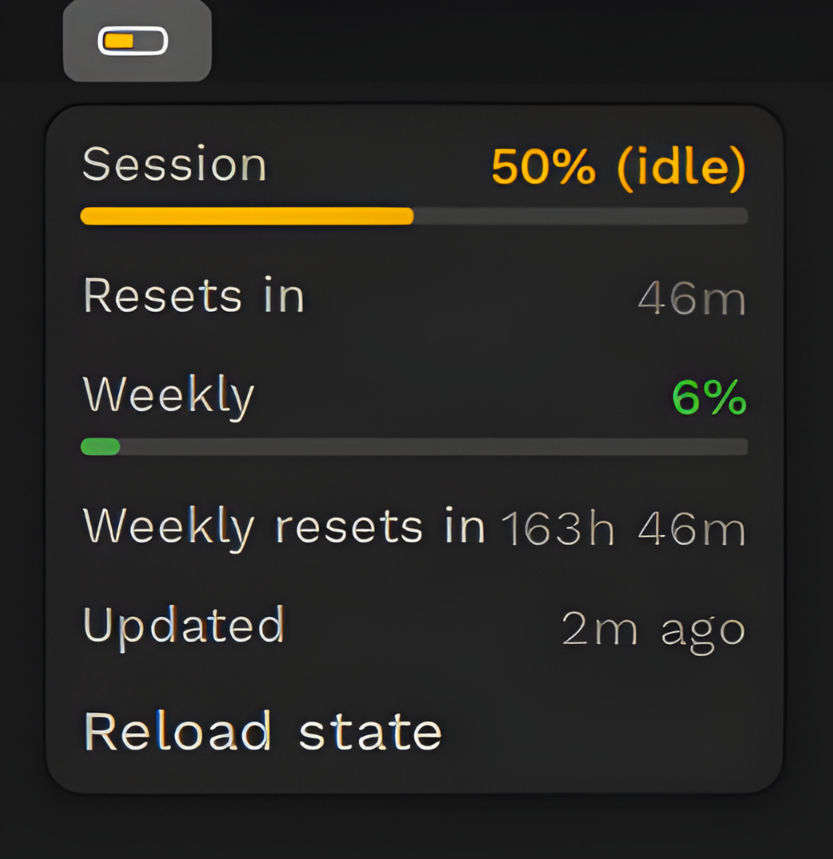

# battery-gnome

Check your Claude Code usage in real time — GNOME Shell extension for Linux.

Shows session and weekly utilization as a progress bar in the GNOME top bar, color-coded green → yellow → orange → red as you approach your rate limit.

> **macOS user?** See the original app: [allthingsclaude/battery](https://github.com/allthingsclaude/battery)

---

## What it shows

| State | Panel |
|-------|-------|
| Normal | `[▓▓▓░░░] 42% · 1h 18m` |
| Login needed | `Battery Sign in` |
| Loading | `Battery …` |
| Stale data | `Battery Stale` |
| Error | `Battery Error` |

Clicking the indicator opens a popup with:
- Session utilization — progress bar + percentage + active/idle status
- Weekly utilization — progress bar + percentage
- Reset countdowns
- Account and plan info
- Last updated time

## Screenshots



## Requirements

- GNOME Shell 46, 47, or 48
- Linux (tested on Ubuntu 24.04 / Fedora 41)
- Node.js 20+

## Structure

```
battery-gnome/
  core/       — Node.js/TypeScript service (systemd, OAuth, polling)
  extension/  — GNOME Shell extension (GJS, Cairo, St)
```

The core service runs as a systemd user service, polls the Anthropic usage API, and writes `~/.battery/state.json`. The extension reads that file and renders the panel UI. They communicate only through the state file — no sockets, no IPC.

## Install

### 1. Clone

```bash
git clone https://github.com/rfxlamia/battery-gnome.git
cd battery-gnome
```

### 2. Install and start the core service

```bash
cd core
./install-local.sh
```

### 3. Install the GNOME extension

```bash
cd ../extension
./install-local.sh
gnome-extensions enable battery@allthingsclaude.local
```

> **Note:** `npm install` is only needed if you want to run tests. The extension itself is pure JavaScript and requires no dependencies to run.

### 4. Reload GNOME Shell

- **X11:** `Alt+F2` → type `r` → Enter
- **Wayland:** Log out and log back in

## Sign in

If the panel shows **Battery Sign in**, click it and select **Sign in**. This opens browser-based OAuth using the same credentials as Claude Code.

After completing OAuth, the extension updates on the next poll cycle (≤30 seconds).

> **Wayland note:** First discovery of a newly installed extension may still require logout/login.

## Verify install

```bash
bash extension/scripts/check-install.sh
```

Checks: extension files present, GNOME Shell aware, core service active.

## Troubleshooting

**Battery Stale** — core service not writing fresh data:
```bash
systemctl --user status battery-core.service
systemctl --user restart battery-core.service
```

**Extension not appearing** — check GNOME Shell version compatibility:
```bash
gnome-shell --version   # must be 46, 47, or 48
gnome-extensions list | grep battery
```

## Development

```bash
# Core tests (TypeScript, Vitest)
cd core && npm test

# Extension tests (pure JS, no GNOME Shell required)
cd extension && npm test
```

## License

MIT
